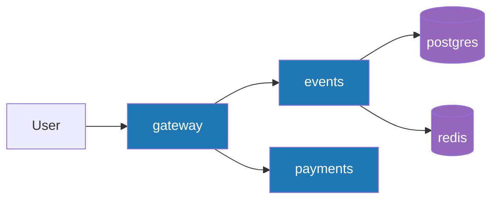

# Lab 1 — SRE Philosophy: Deploy, Break, Understand

## Task 1 — Deploy & Break QuickTicket

### Healthy stack

```text
$ cd /home/n1qro/programming/SRE-Intro/app && docker compose ps
NAME             IMAGE                COMMAND                  SERVICE    STATUS
app-events-1     app-events           "uvicorn main:app --…"   events     Up 9 seconds
app-gateway-1    app-gateway          "uvicorn main:app --…"   gateway    Up 3 seconds
app-payments-1   app-payments         "uvicorn main:app --…"   payments   Up About a minute
app-postgres-1   postgres:17-alpine   "docker-entrypoint.s…"   postgres   Up About a minute (healthy)
app-redis-1      redis:7-alpine       "docker-entrypoint.s…"   redis      Up About a minute (healthy)
```

### Critical path

```text
$ curl -sS http://localhost:3080/events
[{"id":1,"name":"Go Conference 2026","venue":"Main Hall A","date":"2026-09-15T09:00:00+00:00","total_tickets":100,"price_cents":5000,"available":100},{"id":4,"name":"Python Workshop","venue":"Lab 301","date":"2026-09-22T14:00:00+00:00","total_tickets":25,"price_cents":2000,"available":25},{"id":2,"name":"SRE Meetup","venue":"Room 204","date":"2026-10-01T18:00:00+00:00","total_tickets":30,"price_cents":0,"available":30},{"id":5,"name":"Kubernetes Deep Dive","venue":"Auditorium B","date":"2026-10-10T10:00:00+00:00","total_tickets":80,"price_cents":8000,"available":80},{"id":3,"name":"Cloud Native Summit","venue":"Expo Center","date":"2026-11-20T10:00:00+00:00","total_tickets":500,"price_cents":15000,"available":500}]

$ curl -sS -X POST http://localhost:3080/events/1/reserve -H 'Content-Type: application/json' -d '{"quantity": 1}'
{"reservation_id":"8a40d852-c7df-481e-9d86-371f6fddeff8","event_id":1,"quantity":1,"total_cents":5000,"expires_in_seconds":300}

$ curl -sS -X POST http://localhost:3080/reserve/92d80ded-0d87-48b6-b05c-e215d2eed3eb/pay
{"order_id":"92d80ded-0d87-48b6-b05c-e215d2eed3eb","event_id":1,"quantity":1,"total_cents":5000,"status":"confirmed"}

$ curl -s http://localhost:3080/health
{"status":"healthy","checks":{"events":"ok","payments":"ok","circuit_payments":"CLOSED"}}
```

### Dependency map



### Failure table

| Component Killed | Events List | Reserve | Pay | Health Check | User Impact |
|------------------|-------------|---------|-----|--------------|-------------|
| payments | 200 OK | 200 OK | 503 Service Unavailable: {"error":"payments_unavailable","message":"Payment service is temporarily down...","reservation_id":"..."} | 503 degraded, payments: down | Browse and reserve still work; checkout is blocked until payments returns. |
| events | 502 Bad Gateway | 502 Bad Gateway | 500 Internal Server Error: "Payment succeeded but confirmation failed — contact support" | 503 degraded, events: down | Browsing and reserving fail immediately; checkout cannot complete because confirmation is down. |
| redis | 200 OK | 504 Gateway Timeout | 500 Internal Server Error: "Payment succeeded but confirmation failed — contact support" | 503 degraded, events: down | Browsing still works, but new reservations time out and checkout cannot finish because reservation state is unavailable. |
| postgres | 502 Bad Gateway | 500 Internal Server Error | 500 Internal Server Error: "Payment succeeded but confirmation failed — contact support" | 503 degraded, events: degraded | The core ticket store is unavailable, so browse/reserve break and checkout cannot be confirmed. |

### Load generator

```text
$ ./app/loadgen/run.sh 5 30
QuickTicket Load Generator
Target: http://localhost:3080 | RPS: 5 | Duration: 30s
---
[10s] requests=30 success=30 fail=0 error_rate=0%
[10s] requests=31 success=31 fail=0 error_rate=0%
[10s] requests=32 success=32 fail=0 error_rate=0%
[10s] requests=33 success=33 fail=0 error_rate=0%
[20s] requests=70 success=65 fail=5 error_rate=7.1%
[20s] requests=71 success=66 fail=5 error_rate=7.0%
[20s] requests=72 success=67 fail=5 error_rate=6.9%
---
Done. total=107 success=99 fail=8 error_rate=7.4%
```

The error rate stayed at 0% while the stack was healthy, then rose after `payments` was stopped during the run.

## Task 2 — Graceful Degradation

### Gateway diff

```diff
diff --git a/app/gateway/main.py b/app/gateway/main.py
index c86db33..2f69020 100644
--- a/app/gateway/main.py
+++ b/app/gateway/main.py
@@ -332,6 +332,15 @@ async def pay_reservation(reservation_id: str):
	 except CircuitOpenError:
		 log.error("circuit open, skipping payments call")
		 raise HTTPException(503, "Payment service temporarily unavailable (circuit open)")
+    except httpx.RequestError:
+        return JSONResponse(
+            status_code=503,
+            content={
+                "error": "payments_unavailable",
+                "message": "Payment service is temporarily down. Your reservation is held — try again in a few minutes.",
+                "reservation_id": reservation_id,
+            },
+        )
	 except httpx.TimeoutException:
		 raise HTTPException(504, "Payment service timeout")
	 except httpx.HTTPStatusError as e:
```

### Validation when payments is down

```text
$ docker compose stop payments
$ curl -sS -X POST http://localhost:3080/events/1/reserve -H 'Content-Type: application/json' -d '{"quantity": 1}'
{"reservation_id":"0f40c203-85c3-4e8e-976f-e602c91553cf","event_id":1,"quantity":1,"total_cents":5000,"expires_in_seconds":300}

$ curl -sS -D - -X POST http://localhost:3080/reserve/0f40c203-85c3-4e8e-976f-e602c91553cf/pay
HTTP/1.1 503 Service Unavailable
content-type: application/json

{"error":"payments_unavailable","message":"Payment service is temporarily down. Your reservation is held — try again in a few minutes.","reservation_id":"0f40c203-85c3-4e8e-976f-e602c91553cf"}
```

## Task 3 — GitHub Community

Stars help people bookmark and signal interest in useful open-source projects, which increases visibility and helps maintainers understand what the community values. Following developers makes team activity easier to track, supports collaboration in class projects, and helps build a professional network around shared technical work.

## Bonus Task — Resource Usage Under Load

### Baseline (idle, no traffic)

| Service | CPU % | Memory | Net I/O |
|---------|-------|--------|---------|
| gateway | 0.23% | 40.69 MiB | 195 kB / 189 kB |
| events | 0.42% | 44.67 MiB | 162 kB / 201 kB |
| postgres | 0.00% | 28.12 MiB | 81.7 kB / 93.2 kB |
| payments | 0.24% | 40.99 MiB | 6.11 kB / 264 B |
| redis | 1.60% | 10.23 MiB | 25.2 kB / 7.64 kB |

### Under load (10 RPS for 20s)

| Service | CPU % | Memory | Net I/O |
|---------|-------|--------|---------|
| gateway | 6.59% | 40.98 MiB | 295 kB / 287 kB |
| events | 3.53% | 44.74 MiB | 250 kB / 320 kB |
| postgres | 0.77% | 28.14 MiB | 131 kB / 148 kB |
| payments | 0.57% | 41.7 MiB | 10.1 kB / 3.07 kB |
| redis | 1.36% | 10.38 MiB | 39 kB / 13.3 kB |

### Chaos (payments: 30% failure, 500ms latency, load 10 RPS)

| Service | CPU % | Memory | Net I/O |
|---------|-------|--------|---------|
| gateway | 3.24% | 41.03 MiB | 480 kB / 470 kB |
| events | 1.85% | 44.82 MiB | 406 kB / 529 kB |
| postgres | 0.41% | 28.14 MiB | 216 kB / 249 kB |
| payments | 0.36% | 36.16 MiB | 7.2 kB / 3.39 kB |
| redis | 1.37% | 10.39 MiB | 61.9 kB / 22.9 kB |

### Analysis

**Memory usage:** Events service uses the most memory at rest (44.67 MiB) and remains high under all conditions (~44.8 MiB), suggesting database connection pooling. Memory usage is stable across scenarios — no leaks observed.

**CPU under load:** Gateway dominates CPU usage when the system is healthy (6.59%), because it handles all incoming HTTP traffic and orchestrates the call path. Events uses 3.53% CPU for database queries and reservation logic.

**Fault injection impact:** When payments fails 30% of the time with 500ms latency, gateway CPU drops to 3.24% because failed payment calls complete faster (return errors immediately or after timeout) compared to successful paths that must call events for confirmation. The chaotic scenario produces less sustained CPU load on the gateway.

**Network I/O spike:** During normal load and chaos, gateway network I/O increases significantly (295 kB → 480 kB egress due to retries and error responses), confirming that fault injection increases network traffic through repeated attempts and fallback paths.

